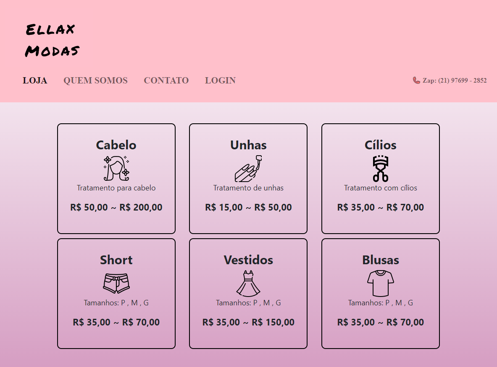

# Ellax Modas

Bibliotecas utilizadas: Bootstrap

Este conteúdo esta sendo criado junto com as minhas aulas de front-end da faculdade onde irei criar um projeto.

Em todos as páginas o menu é um navbar do bootstrap.

Na página Loja foi mais utilizado CSS para dimensionar e para apresentação, temos uma vitrine dos produtos ofertado pela loja Ellax.

Na página "Quem Somos" foi mais utilizado CSS para dimensionar e para apresentação, nela temos alguns conteúdos utilizados para apresentação da loja e para indicar o local ao cliente.

Na página "Contato" foi utilizado CSS para dimensionar inputs e labels formatar devidamente o formulário para contato com a Ellax Modas.

Na página "Login" foi utilizado CSS para o botão "Login" e os outros inputs foram inputs do Bootstrap.

[As imagens utilizadas na página "Loja" foram retirados deste site](https://www.flaticon.com/br/)
