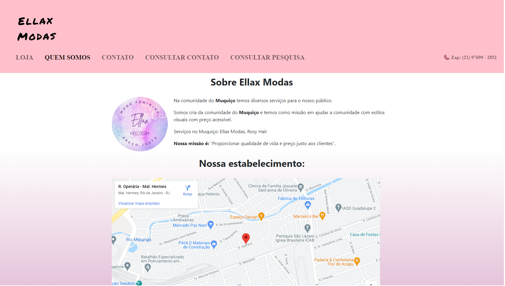

# Ellax Modas


# Criar o Database em SQL:
```
create database contato;
```
# Criar a tabela de contato em SQL:
```
CREATE TABLE cliente ( id INT NOT NULL identity , nome VARCHAR(90) NOT NULL ,
email VARCHAR(90) NOT NULL , telefone INT NOT NULL ,
sexo BINARY(1) NOT NULL , mensagem VARCHAR(120) NOT NULL ,
data_contato DATE NOT NULL , novidade BINARY(1) NOT NULL , PRIMARY KEY (id));
```
# Criar a tabela de pesquisa em SQL:
```
create table pesquisa (
	id serial primary key,
	email varchar(100),
	pergunta1 integer,
	pergunta2 integer
    );
```

Bibliotecas utilizadas: Bootstrap, W3school

Este conteúdo esta sendo criado junto com as minhas aulas de front-end da faculdade onde irei criar um projeto.

Em todos as páginas o menu é um navbar do bootstrap.

Possui integração com PHP. nesse caso foi utilizado o PHPmyadmin.

Neste projeto conseguimos inserir dados pela página 'Contato' e consultar pela página 'Consulta BD'

Foi desafiado fazer uma parte de dados do cliente e um outro com dados de uma pesquisa separados mas foi decidido posteriormente juntar por sentido lógico e pensando na facilidade ao cliente.

no arquivo 'grava.php' possui um comentário com o código SQL caso queiram testar o site.

Na página Loja foi mais utilizado CSS para dimensionar e para apresentação, temos uma vitrine dos produtos ofertado pela loja Ellax.


Na página "Quem Somos" foi mais utilizado CSS para dimensionar e para apresentação, nela temos alguns conteúdos utilizados para apresentação da loja e para indicar o local ao cliente.



Na página "Contato" foi utilizado CSS para dimensionar inputs e labels formatar devidamente o formulário para contato com a Ellax Modas.


Na página "Login" foi utilizado CSS para o botão "Login" e os outros inputs foram inputs do Bootstrap.


[As imagens utilizadas na página "Loja" foram retirados deste site](https://www.flaticon.com/br/)
